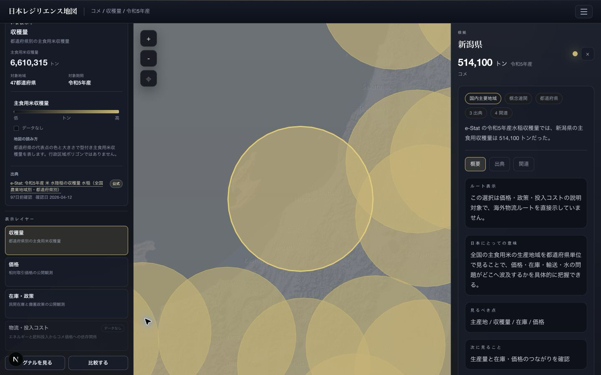

# 日本レジリエンス地図

[English](README.md) | 日本語

日本レジリエンス地図は、公式統計を入口にした公共目的の地図ワークスペースです。意味別の地図レイヤー、単一のコンテキストインスペクタ、出典根拠、明示的に開くシグナル／比較ビューを通じて、日本の暮らし・産業・インフラ・戦略的依存を説明します。

初期表示は `Rice / コメ` と e-Stat の都道府県別収穫量です。`Energy`、`Logistics`、`Water`、`Defense`、`Semiconductors`、`Regional Security / 地域安全保障` も同じオントロジー上に残し、全球ルートや物流デモは初期画面の主張ではなく補助文脈として扱います。

## 製品方針（2026-07 更新）

公開MVPの骨格を **e-Stat など公式統計** に寄せる方針を **承認** しました（Option A）。公開タイトルは **日本レジリエンス地図**。経済安全保障は「監視レーダー製品名」ではなく、**問いのレンズ**です。全球ルートや AIS デモは文脈の補助線で、ホーム初期表示には出しません。

- **エージェント引き継ぎ（Codex 等はここから）:** [`docs/product/2026-07-13-estat-spine-handoff-prd.md`](docs/product/2026-07-13-estat-spine-handoff-prd.md)
- 決定メモ: [`docs/product/2026-07-13-estat-spine-decision-memo.md`](docs/product/2026-07-13-estat-spine-decision-memo.md)
- コンセプトリフレーム: [`docs/product/2026-07-13-estat-spine-concept-reframe-prd.md`](docs/product/2026-07-13-estat-spine-concept-reframe-prd.md)
- e-Stat × テーマ対応: [`docs/product/2026-07-13-estat-data-theme-map.md`](docs/product/2026-07-13-estat-data-theme-map.md)
- 検証計画: [`docs/product/2026-07-13-estat-validation-plan.md`](docs/product/2026-07-13-estat-validation-plan.md)

## 公開デモ

- Version: `0.5.0`
- Demo: [economic-security.quadrillionaaa.com](https://economic-security.quadrillionaaa.com/)
- Launch view: [都道府県別コメ収穫量](https://economic-security.quadrillionaaa.com/?theme=rice&layer=rice-harvest)
- 最初の約束: 公式数字と追跡可能な出典から、暮らしと産業の脆さを説明する
- 公開 framing: 日本中心の対象範囲、意味別レイヤー、公式出典・単位・期間、単一インスペクタ、必要時だけ開くシグナル／比較

## 現在のバージョン

`v0.5.0` では、デスクトップを地図中心のワークスペースへ再構成しました。左ペインに対象範囲、期間、単位、出典、意味レイヤーを集約し、中央は地図、右は選択時だけ開く単一インスペクタに整理しています。シグナルと比較は明示操作で開く副次ビューです。従来URLとの互換性を保ち、既存Mobile構成は維持しますが、Mobile再設計の完了は主張しません。物流経路は固定デモと明示し、型付き・出典付き指標がない物流影響レイヤーは無効のままです。

`v0.4.0` では `Regional Security / 地域安全保障` theme と、公式公開データを重複なく取り込むための source adapter foundation を追加しました。初期 slice は、北朝鮮ミサイル発射履歴、代表発射地域・落下/影響推定区域・代表軌道、中国など周辺航空・海上活動の公開集約 placeholder を扱います。公開・履歴・遅延・集約情報に限定し、ライブ警報、作戦追跡、ターゲティング、完全な脅威 coverage は主張しません。

`v0.3.1` は theme boundary correction release です。エネルギー系タンカー、原油、LNG、石炭、LNG carrier、エネルギー受入ルートは `Energy` だけで表示します。`Logistics` は国内道路、鉄道、内航、港湾後続、bounded な非エネルギー一般貨物、航空貨物、空港運用に限定します。

`v0.3.0` では Logistics + Airport operational layer を追加しました。空港シグナルは公開・集約・遅延された infrastructure/cargo 文脈に限定し、個別機体、個別便、旅客、軍用機追跡、CCTV、threat dashboard 的な表現は対象外です。

`v0.2.0` では、active theme の出典状態バーを追加し、e-Stat、BOJ、国会会議録の公式 fetch 経路を timeout-aware な共通 request helper で堅牢化しました。

## 公開プレビュー



現在の公開面は、e-Stat のコメ収穫量レイヤーから始まります。対象範囲、期間、単位、凡例、公式出典を地図の横に保ち、都道府県を選ぶと出典付きのインスペクタが1つだけ開きます。シグナルと47都道府県比較は必要なときだけ表示します。

## 中心となる問い

> 日本は今なにを注視すべきか。そして、そのシグナルは暮らし、公共支出、国内インフラのどこに着地するのか。

この問いを、次の規律あるワークスペースで見せます。

- `対象範囲と意味レイヤー`: 対象地域、期間、単位、凡例、出典を常に確認できるようにする。
- `日本地図ワークスペース`: 公式地域統計、観測値、拠点、依存ルートを意味を混ぜずに表示する。
- `コンテキストインスペクタ`: 選択した事実、provenance、関連根拠を1つの詳細面にまとめる。
- `シグナルと比較`: 必要時だけ開き、単位・期間・共通出典が揃うデータだけを比較する。
- `補助テーマ`: Energy、bounded な Logistics、Water、Defense、Semiconductors、履歴・集約型の Regional Security を保持する。
- `全球補助レイヤー`: 日本への影響を説明する場合に限り、供給国、海上ルート、チョークポイントを表示する。

このプロジェクトの主語は日本です。外国は、あくまで日本人の暮らしや安全保障への影響を説明するために表示します。一般的な国別プロフィール集ではありません。

## セマンティックWebを使う理由

目的は、きれいな地図を描くだけではありません。日本の依存関係、政策根拠、予算、法令、出典を、後から OWL / RDF / SHACL / SPARQL に自然に移行できる形で設計することが目的です。

現在の MVP では、すでに次の層を分けています。

- `types/semantic.ts`: 国、地域、資源、製品、依存フロー、観測値、出典、グラフエッジの意味モデル。
- `data/seed/`: Phase 0 用のローカル seed JSON。各項目に provenance を持たせ、将来の `prov:wasDerivedFrom` に対応しやすくしている。
- `ontology/`: OWL/RDF 化を前提にした初期 Turtle ファイル。
- `queries/`: 地域安全保障を含む theme-specific な公共ストーリーに対応する SPARQL クエリ例。
- `lib/semantic/`: テーマ別 selector、detail view、provenance helper、SPARQL preview、表示用 view model。

各詳細パネルには、概要、日本にとっての意味、出典文書、関連エンティティ、将来の SPARQL クエリ案を表示します。

## MVP の範囲

MVP では、各テーマについて薄いが一貫した一連の導線を入れています。

- `Energy`: 原油、LNG、石炭、湾岸ルート、ホルムズ海峡、マラッカ海峡、横浜港、袖ケ浦LNG受入基地、京浜製油所エリア。
- `Logistics`: 国内道路、鉄道、内航、航空貨物、空港運用、港湾後続、bounded な非エネルギー一般貨物 overlay、運用ステータスシグナル。全船舶の完全リアルタイム coverage や個別便・個別機体情報の coverage は主張しない。
- `Regional Security / 地域安全保障`: 北朝鮮ミサイル発射履歴、代表発射地域、落下/影響推定区域、代表軌道、中国など周辺航空・海上活動の公開集約 placeholder、防衛省・統幕・J-Alert 関連資料・CNS/NTI・reviewed open-source reference への出典接続。
- `Rice`: コメ価格圧力、備蓄・政策シグナル、エネルギーや肥料投入が家計の食料負担へつながる流れ。
- `Water`: 東京都と小河内貯水池を使った水ストレス例。
- `Defense`: 2026年度防衛予算からスタンド・オフ防衛能力への予算フロー例。
- `Semiconductors`: 台湾、韓国、オランダ、米国、中国と日本を結ぶ先端半導体依存フロー。

Phase 0 の物流面は、意図的に bounded にしています。国内の道路・鉄道・内航・航空貨物・空港運用、港湾後続、日本側の港湾・空港、非エネルギー一般貨物、bounded な港湾後続 overlay、小さな災害ライフライン watch slice までを扱います。LNG受入基地、製油所、エネルギー系タンカー、LNG/原油ルートは `Energy` の対象です。全船舶の完全リアルタイム coverage や個別便・個別機体情報の coverage は主張しません。それには licensed provider integration が必要です。

## ロードマップ

`Phase 0`: 公開 MVP

- 無料公開サイト。
- 認証なし。
- データベースなし。
- ローカル seed JSON と Turtle artifact。
- Cloudflare だけで運用できる構成を優先。
- 日本人向けの依存インテリジェンスとして公開する。

`Phase 1`: 地政学的隣国レイヤー

- 主語は引き続き日本と日本人。
- 日本への影響説明に必要な範囲で、地政学的隣国との関係を追加する。
- ルート、港湾、施設、出典文書の対象範囲を増やす。
- 繰り返し可能な取り込み処理と検証を始める。
- 公式公開API、CKAN catalog、GeoJSON/tile、reviewed CSV/Excel dataset、公開ページを source adapter として拡張する。
- 非エネルギー物流 coverage のため、licensed port-call / cargo-status provider を評価し、energy AIS / tanker coverage は Energy theme に残す。

`Phase 2`: 法人・組織向け intelligence product

- メディア、シンクタンク、政策チーム、リスク管理チーム、事業戦略チーム向けの有料ワークスペース。
- ルート、資源、政策、予算、出典更新に関するアラート。
- 非公開シナリオノートブックと保存済みグラフビュー。
- 依存グラフの部分データに対する API / データアクセス。
- 内部データ統合とカスタムオントロジーマッピング。
- OWL / RDF / SPARQL / SHACL 導入支援パッケージ。

Palantir 的に考えるなら、長期価値は公開地図そのものではありません。公共データ、民間データ、出典根拠、アラート、シナリオ、意思決定の流れをつなぐセマンティック運用レイヤーが価値になります。この MVP は、Phase 0 を過剰な法人向け製品にせず、その将来拡張だけを設計上残しています。

## ローカル起動

```bash
npm install
npm run dev
```

テストと本番ビルド:

```bash
npm test
npm run build
```

Cloudflare Workers 実行環境に近いプレビュー:

```bash
npm run preview
```

Cloudflare Workers への手動デプロイ:

```bash
npm run deploy
```

このコマンドは **手動 fallback** です。現在の本番運用は `main` への commit & push を起点に、GitHub Actions の deploy job で自動反映する前提です。

Cloudflare への手動 deploy は、`CLOUDFLARE_API_TOKEN` に **ユーザートークン** を使う前提です。最低限必要なのは次です。

- User: `User Details (read)`
- User: `Memberships (read)`
- Account: `Account Settings (read)`
- Account: `Workers Scripts (edit)`
- Zone: `Workers Routes (edit)`

CI/CD やローカルの非対話 deploy では、必要に応じて `CLOUDFLARE_ACCOUNT_ID` も渡します。

UI の表示自体は外部環境変数なしで動きます。
ただし、今後 `e-Stat API` を live で叩く場合は `.env.local` に次を追加します。

```bash
ESTAT_APP_ID=your-estat-app-id
```

`appId` は [e-Stat](https://www.e-stat.go.jp/) のユーザー登録後、マイページの API 機能から発行します。公開前のローカル開発でも、登録時の URL は `http://localhost/` で問題ありません。

## Cloudflare Workers 配備

Phase 0 から `Cloudflare Workers + OpenNext adapter` を前提にします。
本番の想定URLは `economic-security.quadrillionaaa.com` です。

- Worker runtime: Cloudflare Workers
- adapter: `@opennextjs/cloudflare`
- config: [`wrangler.jsonc`](wrangler.jsonc)
- OpenNext: [`open-next.config.ts`](open-next.config.ts)

## 現在のデプロイ仕様

現在の本番更新ルートは次です。

- GitHub の `main` が source of truth
- `main` への commit & push
- GitHub Actions の `CI` workflow が `verify -> deploy` を実行
- 本番 host は `economic-security.quadrillionaaa.com`

つまり、通常運用では `commit & push = deploy` です。

`npm run deploy` は、GitHub Actions が使えない時の **手動 fallback** としてだけ扱います。

注意点:

- Cloudflare Workers の custom domain は **active Cloudflare zone** が前提です。
- つまり `economic-security.quadrillionaaa.com` を Worker に直結するなら、`quadrillionaaa.com` は Cloudflare 側で管理されている必要があります。
- Route53 を authoritative DNS のまま維持したい場合は、Workers custom domain より Pages 側の方が簡単です。
- 今回は将来の server-side fetch、secret、scheduled ingestion を見越して Workers を採用しています。
- GitHub repository secrets に `CLOUDFLARE_API_TOKEN` と `CLOUDFLARE_ACCOUNT_ID` を設定してください。
- `npm run deploy` や GitHub Actions deploy が `/memberships` や `/workers/services/...` で `Authentication failed` になる場合は、CLI バージョンだけでなく API token の権限不足を疑ってください。
- Cloudflare ダッシュボード側の Git integration は不要です。残っていてもかまいませんが、repo 側の workflow を正とみなします。

この運用は、**収益化前の Phase 0 / Phase 1 までの公開運用**として扱います。

- GitHub 公開リポジトリを source of truth にする
- `main` と Cloudflare Workers を使って public site を更新する
- public civic layer を速く改善することを優先する

Phase 2 で institutional / paid product に入る時点では、この運用を最終形とみなさず、public site と private runtime を分ける前提で再設計します。

## Sources / License / 問い合わせ

公開サイトでは、アプリ右上のメニューから `共有` `Sources/License` `問い合わせ` を開けます。

`Sources/License` では次を確認できます。

- 出典ソース一覧
- このサイトの利用方針
- 権利処理の考え方

`問い合わせ` では次の連絡を受け付けます。

- 開発依頼
- データ修正/追加
- 不具合・エラー
- 取材・引用/連携
- その他

問い合わせは公開フォームから受け付け、送信先は `ai@quadrillion-ai.com` です。返信先メールアドレスは必須で、機微な個人情報や秘密情報は送信しない前提にします。

## ライセンスとデータ方針

コードのライセンスはリポジトリ直下の [`LICENSE`](LICENSE) に従います。現時点では `Apache-2.0` を採用しています。

この project は MIT ではなく Apache-2.0 を維持します。単純な UI library なら MIT でも問題ありませんが、この project は将来的に institutional layer を持ちうる intelligence / data product です。Apache-2.0 は permissive な open source でありつつ、downstream use に対する patent、notice、trademark の境界を MIT より明確にできます。

一方で `data/seed/` の出典付きデータは、コードと同じ意味で一括再ライセンスしていません。政府・公的機関ソースと民間ソースが混在するため、ソース別条件に従って扱います。詳細は [`DATA-SOURCES.md`](DATA-SOURCES.md) と `Sources/License` ページを参照してください。

公開発表用の文面は [`docs/public-launch.md`](docs/public-launch.md) にまとめています。

## ディレクトリ構成

```text
app/                    Next.js App Router の入口
components/             日本運用マップ、国際補助レイヤー、オペレーション表、根拠ドロワー、アプリ外枠
data/seed/              Phase 0 用のローカル semantic seed data
docs/                   公開向けの deployment と source registry ドキュメント
lib/data/               seed graph の読み込み処理
lib/semantic/           selector、detail view、provenance、SPARQL、表示用 model
ontology/               初期 Turtle ontology stub
queries/                SPARQL query example
types/                  semantic type と presentation type
```

## データと provenance

現時点では手動 seed data の MVP です。リアルタイムの公共データ配信でも、運用判断に使うインテリジェンスシステムでもありません。`Regional Security / 地域安全保障` も同じ境界で扱い、公開根拠、履歴・集約文脈、非ライブ警報・非ライブ追跡を明示します。

ただし、各 entity、flow、observation は出典参照を持つ設計です。長期的には、この出典参照を `prov:wasDerivedFrom` を使った RDF triple に変換し、SHACL で検証し、SPARQL endpoint から提供することを目指します。

## 公共目的の注意

このプロジェクトは、日本に住む人が依存関係、政策根拠、国内影響を理解するためのものです。軍事的なターゲット選定 UI、恐怖を煽るダッシュボード、汎用的な国別探索ツールにはしません。プロダクトの主語は、日本と日本人です。
